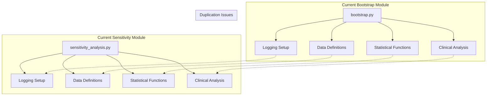
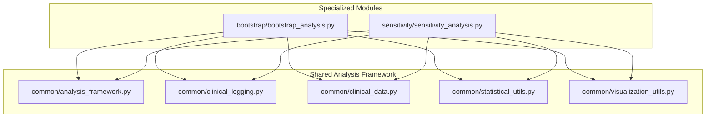
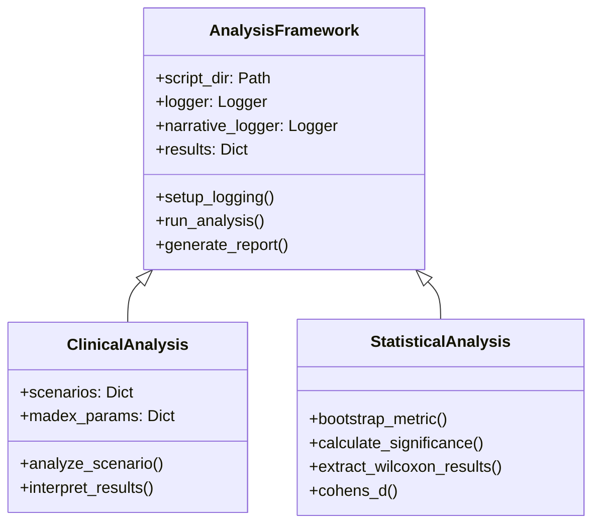
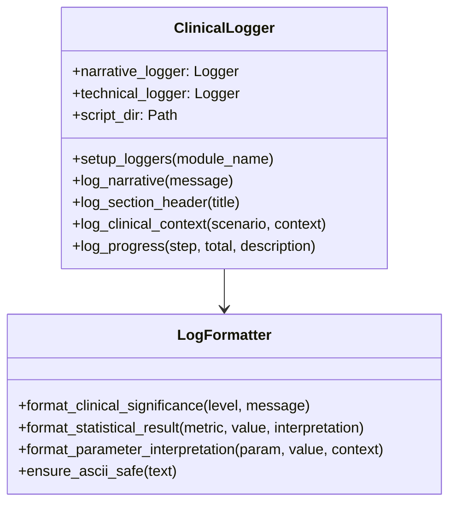
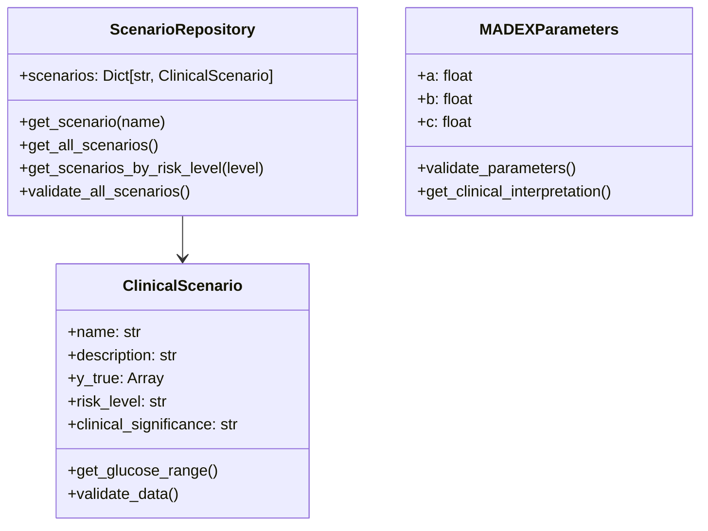
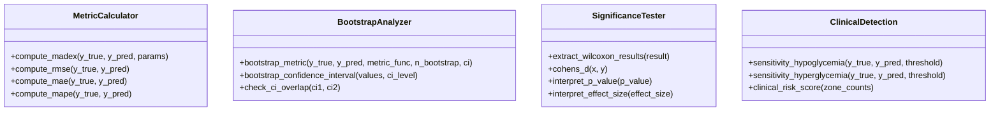
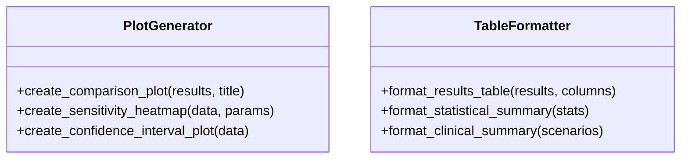
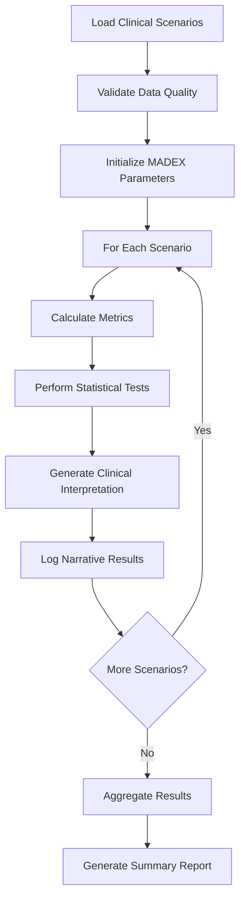
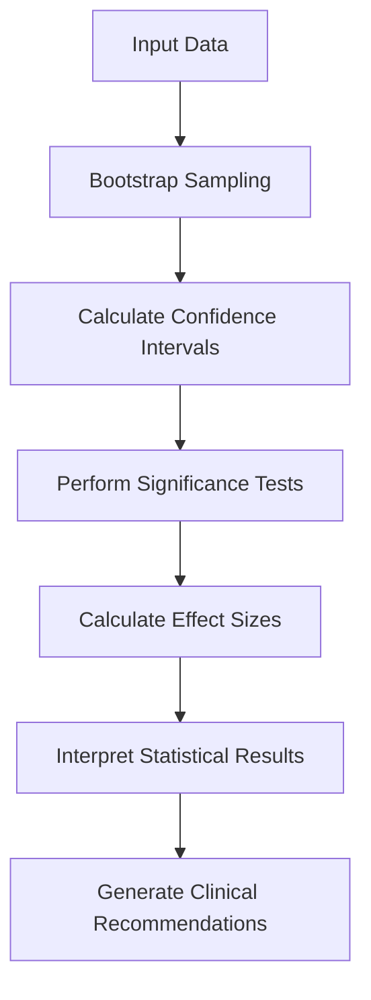
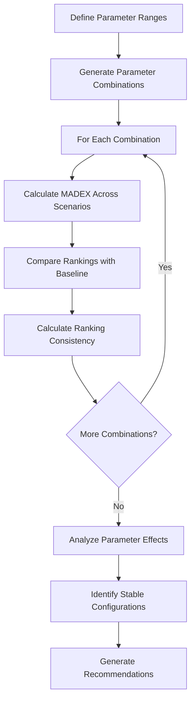

# Bootstrap-Sensitivity Common Components Refactoring Design

## Overview

This design document outlines the refactoring of common functionality between the bootstrap and sensitivity analysis modules into shared components. The analysis reveals significant code duplication in logging infrastructure, clinical scenario management, statistical calculations, and data validation patterns.

## Architecture

### Current State Analysis

Both modules implement similar patterns:



### Target Architecture



## Component Architecture

### 1. Common Analysis Framework (`common/analysis_framework.py`)

Core base classes and interfaces for statistical analysis:



### 2. Clinical Logging System (`common/clinical_logging.py`)

Unified LLM-friendly narrative logging infrastructure:



### 3. Clinical Data Management (`common/clinical_data.py`)

Standardized clinical scenario definitions and data structures:



### 4. Statistical Utilities (`common/statistical_utils.py`)

Common statistical calculation functions:



### 5. Visualization Utilities (`common/visualization_utils.py`)

Shared plotting and data presentation functions:



## Data Models & Validation

### Clinical Scenario Structure

| Field | Type | Description | Validation |
|-------|------|-------------|------------|
| name | str | Scenario identifier | Required, unique |
| description | str | Brief clinical description | Required |
| y_true | Array | Reference glucose values | Required, positive values |
| risk_level | str | Clinical risk assessment | One of: CRITICAL, HIGH, MODERATE, LOW |
| clinical_significance | str | Detailed clinical context | Required |
| model_predictions | Dict | Model prediction arrays | Optional, same length as y_true |

### MADEX Parameters Structure

| Parameter | Type | Range | Clinical Meaning |
|-----------|------|-------|------------------|
| a | float | 80-180 mg/dL | Euglycemic center (target glucose) |
| b | float | 20-100 | Critical range (sensitivity to deviations) |
| c | float | 10-100 | Slope modifier (error scaling factor) |

## Business Logic Layer

### 1. Scenario Analysis Engine



### 2. Statistical Validation Pipeline



### 3. Parameter Sensitivity Analysis



## Refactoring Implementation Plan

### Phase 1: Core Infrastructure

1. **Create common directory structure**
   - `src/new_metric/common/`
   - Move shared utilities to common package

2. **Extract logging infrastructure**
   - Consolidate dual logging system (technical + narrative)
   - Standardize LLM-friendly formatting
   - Implement ASCII-safe encoding

3. **Standardize clinical data definitions**
   - Create unified scenario repository
   - Implement data validation
   - Define standard data structures

### Phase 2: Statistical Functions

1. **Extract common statistical functions**
   - MADEX calculation with logging
   - Traditional metrics (RMSE, MAE, MAPE)
   - Bootstrap analysis utilities
   - Significance testing helpers

2. **Create clinical interpretation layer**
   - Parameter meaning explanations
   - Risk level assessments
   - Clinical detection functions

### Phase 3: Analysis Framework

1. **Develop base analysis classes**
   - Common analysis workflow
   - Results aggregation patterns
   - Report generation framework

2. **Implement specialized analyses**
   - Bootstrap confidence interval analysis
   - Parameter sensitivity testing
   - Comparative metric evaluation

### Phase 4: Module Refactoring

1. **Refactor bootstrap module**
   - Use common infrastructure
   - Reduce code duplication
   - Maintain existing functionality

2. **Refactor sensitivity module**
   - Use shared components
   - Preserve analysis logic
   - Ensure result consistency

## Testing Strategy

### Validation Approach

1. **Functional Equivalence Testing**
   - Compare outputs before/after refactoring
   - Verify numerical accuracy within tolerance
   - Validate statistical test results

2. **Clinical Scenario Validation**
   - Test with original data sets
   - Verify clinical interpretations
   - Check ranking consistency

3. **Logging System Testing**
   - Compare log outputs
   - Verify LLM-friendly formatting
   - Test cross-platform compatibility

### Test Cases

| Test Category | Description | Acceptance Criteria |
|---------------|-------------|-------------------|
| Numerical Accuracy | MADEX calculations match exactly | Difference < 1e-10 |
| Statistical Tests | Wilcoxon results identical | p-values match to 6 decimals |
| Clinical Rankings | Model rankings unchanged | 100% ranking consistency |
| Log Content | Narrative logs equivalent | Content semantically identical |
| Performance | Execution time comparable | <10% performance degradation |

## Migration Strategy

### Backward Compatibility

1. **Preserve existing interfaces**
   - Maintain function signatures
   - Keep module entry points
   - Ensure script executability

2. **Gradual migration approach**
   - Phase-by-phase implementation
   - Parallel execution during transition
   - Rollback capability

### Risk Mitigation

1. **Version control strategy**
   - Feature branches for each phase
   - Comprehensive testing before merge
   - Rollback procedures documented

2. **Data validation**
   - Automated comparison testing
   - Statistical validation checks
   - Clinical outcome verification

## Performance Considerations

### Optimization Opportunities

1. **Shared computation caching**
   - Cache MADEX calculations
   - Reuse bootstrap samples
   - Optimize parameter combinations

2. **Memory efficiency**
   - Streaming data processing
   - Efficient numpy operations
   - Reduced object creation

### Monitoring

1. **Performance metrics**
   - Execution time tracking
   - Memory usage monitoring
   - Statistical accuracy validation

2. **Clinical validation**
   - Result consistency checking
   - Ranking stability monitoring
   - Clinical interpretation accuracy

## File Structure Changes

### New Common Package Structure

```
src/new_metric/common/
├── __init__.py
├── analysis_framework.py      # Base analysis classes
├── clinical_logging.py        # LLM-friendly logging system
├── clinical_data.py          # Scenario and parameter definitions
├── statistical_utils.py      # Common statistical functions
└── visualization_utils.py    # Shared plotting utilities
```

### Updated Module Structure

```
bootstrap/
├── __init__.py
├── bootstrap_analysis.py     # Refactored using common components
└── README.md

sensitivity/
├── __init__.py
├── sensitivity_analysis.py   # Refactored using common components
├── narrative_demo.py
└── README.md
```

### Import Path Changes

Before refactoring:
- Direct implementation in each module
- Duplicated logging setup code
- Copied statistical functions

After refactoring:
```python
from new_metric.common.analysis_framework import ClinicalAnalysis
from new_metric.common.clinical_logging import ClinicalLogger
from new_metric.common.statistical_utils import MetricCalculator
```

## Validation Checklist

- [ ] All original test cases pass
- [ ] MADEX calculations numerically identical
- [ ] Statistical test results unchanged
- [ ] Clinical rankings preserved
- [ ] Log outputs semantically equivalent
- [ ] Performance within acceptable range
- [ ] Documentation updated
- [ ] Common package properly structured
- [ ] Import paths working correctly
- [ ] Cross-platform compatibility verified